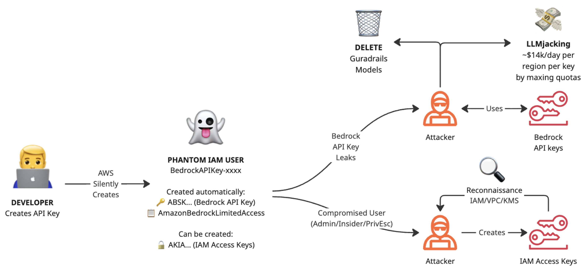
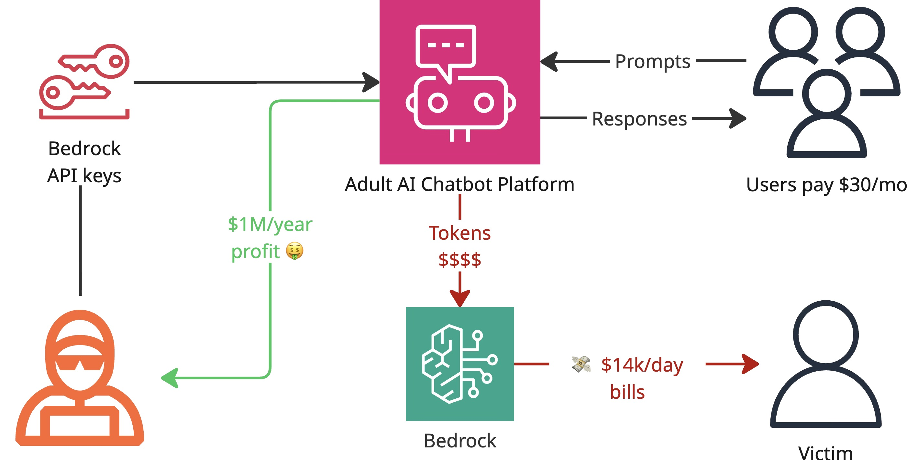
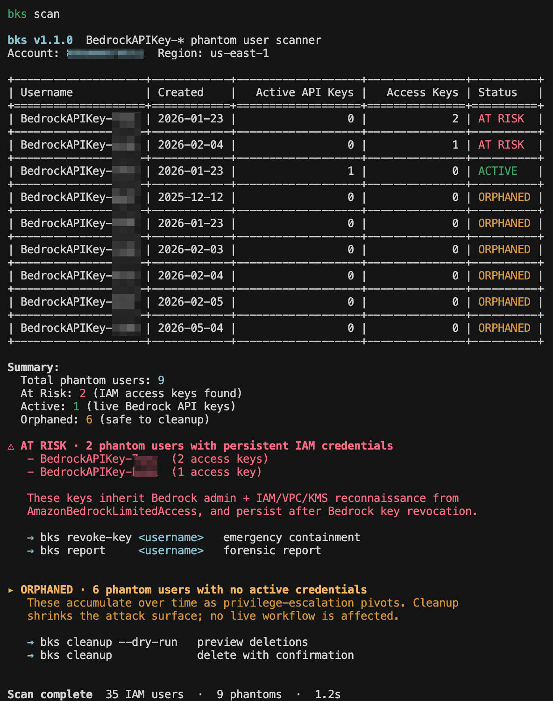
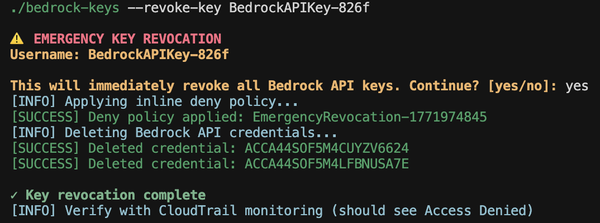
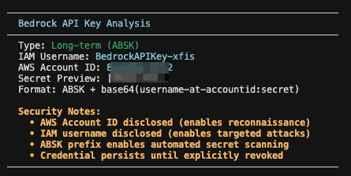
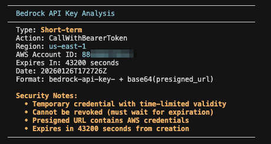

# Bedrock API Keys Security

Security toolkit for AWS Bedrock API keys — discover phantom IAM users, decode leaked keys, automate cleanup, and enforce preventive controls.

[](LICENSE)
[](https://www.python.org/downloads/)

## Overview

AWS Bedrock API keys ([launched July 2025](https://aws.amazon.com/blogs/machine-learning/accelerate-ai-development-with-amazon-bedrock-api-keys/)) introduce multiple security risks that organizations must understand before deployment. While designed to simplify authentication, they create permanent attack surfaces through phantom IAM user creation, overprivileged default policies, and bearer token authentication.

Long-term keys automatically provision IAM users (`BedrockAPIKey-xxxx`) with admin-level Bedrock permissions that persist indefinitely — even after the key is deleted or expires. Within 14 days of launch, keys were already leaking to GitHub. Criminal organizations generate an estimated $1M/year in annualized revenue from stolen keys, with fraudulent charges reaching up to $14,000/day per region.

This toolkit provides:
- **Discovery** — Scan your account for phantom IAM users and categorize their risk
- **Incident Response** — Emergency key revocation, CloudTrail timelines, and forensic reports
- **Key Decoding** — Offline analysis of leaked keys to extract account and identity information
- **Prevention** — Service Control Policies to block or restrict API key usage at the org level

## Motivation

When a user creates a long-term Bedrock API key through the AWS Console, AWS silently provisions an IAM user named `BedrockAPIKey-xxxx` and attaches the `AmazonBedrockLimitedAccess` managed policy. Despite its name, this policy grants broad permissions:

- `bedrock:*` on all resources (full Bedrock admin)
- `iam:ListRoles` (identity enumeration)
- `kms:DescribeKey` (encryption key discovery)
- `ec2:Describe*` (network reconnaissance)

These phantom users are never automatically cleaned up. They accumulate over time, creating an expanding attack surface that most organizations don't know exists.

### Attack Paths



**LLMjacking** — An attacker who obtains a leaked key can spin up workers across all AWS regions to consume foundation model capacity. Organizations have reported fraudulent charges exceeding $14,000/day per region.



**Privilege Escalation** — If an attacker creates an IAM access key on the phantom user, or if one already exists, they gain persistent IAM credentials (`AKIA...`) that extend well beyond Bedrock. From there, they can pivot to S3, Secrets Manager, and other services — even after the original Bedrock key expires.

## Installation

Install from GitHub:

```bash
pip install git+https://github.com/BeyondTrust/bedrock-keys-security.git
```

Or install from source:

```bash
git clone https://github.com/BeyondTrust/bedrock-keys-security.git
cd bedrock-keys-security
pip install .
```

After installation, the `bedrock-keys-security` command is available globally. Requires Python 3.10+ and AWS credentials. Minimum permissions by command:

| Command | IAM Permissions Required |
|---|---|
| `scan` | `iam:ListUsers`, `iam:ListServiceSpecificCredentials`, `iam:ListAccessKeys`, `iam:ListAttachedUserPolicies`, `iam:ListUserPolicies` |
| `cleanup` | All scan permissions + `iam:DeleteAccessKey`, `iam:DeleteServiceSpecificCredential`, `iam:DetachUserPolicy`, `iam:DeleteUserPolicy`, `iam:DeleteUser` |
| `revoke-key` | `iam:PutUserPolicy`, `iam:ListServiceSpecificCredentials`, `iam:DeleteServiceSpecificCredential` |
| `timeline` | `cloudtrail:LookupEvents` |
| `report` | `iam:GetUser`, `iam:ListServiceSpecificCredentials`, `iam:ListAccessKeys`, `iam:ListAttachedUserPolicies`, `iam:ListUserPolicies` |
| `decode-key` | None (offline) |

## Usage

### Scanning

Run a scan to discover all phantom IAM users in your account:

```bash
bedrock-keys-security scan                      # scan with default profile
bedrock-keys-security scan --profile prod       # use a specific AWS profile
bedrock-keys-security scan --json               # machine-readable output
bedrock-keys-security scan --csv output.csv     # export to CSV
bedrock-keys-security scan --verbose            # detailed output
```

Each phantom user is categorized by risk level:
- **ACTIVE** — Has valid Bedrock API credentials
- **ORPHANED** — No active credentials remaining (safe to delete)
- **ESCALATED** — Has IAM access keys, indicating privilege escalation



### Cleanup

Remove orphaned phantom users that no longer have active credentials:

```bash
bedrock-keys-security cleanup --dry-run         # preview what would be deleted
bedrock-keys-security cleanup                   # delete with confirmation prompt
bedrock-keys-security cleanup --force           # skip confirmation (use with caution)
```

Only ORPHANED users are affected. ACTIVE and ESCALATED users are never deleted automatically.

### Incident Response

When a key is compromised, `bedrock-keys-security` provides emergency response capabilities:

```bash
bedrock-keys-security revoke-key BedrockAPIKey-xxxx              # emergency key revocation
bedrock-keys-security timeline BedrockAPIKey-xxxx                # CloudTrail timeline (last 7 days)
bedrock-keys-security timeline BedrockAPIKey-xxxx --days 30      # extended timeline
bedrock-keys-security report BedrockAPIKey-xxxx                  # full incident report
bedrock-keys-security report BedrockAPIKey-xxxx --output report.txt
```

The `revoke-key` command applies an inline deny policy and deletes all Bedrock credentials in a single operation.



### Key Decoding

Decode leaked Bedrock API keys offline — no AWS credentials required:

```bash
bedrock-keys-security decode-key "ABSKQmVkcm9ja0FQSUtleS..."
bedrock-keys-security decode-key "bedrock-api-key-YmVkcm9ja..." --json
```

Extracts the embedded IAM username, AWS account ID, region, and key format. Useful for triaging keys found on GitHub, Pastebin, or other public sources.





## Prevention with Service Control Policies

Four SCPs are provided for organizational enforcement. Apply them to OUs via AWS Organizations.

### 1. Block All API Keys (Recommended)

The simplest approach — block creation and usage of all Bedrock API keys:

```bash
aws organizations create-policy \
  --name Block-Bedrock-API-Keys \
  --type SERVICE_CONTROL_POLICY \
  --content file://scps/1-block-all-keys.json
```

### 2. Enforce 90-Day Maximum Lifetime

If API keys are required, limit the damage window:

```bash
aws organizations create-policy \
  --content file://scps/2-enforce-90day-max.json \
  --type SERVICE_CONTROL_POLICY
```

### 3. Block Long-Term Keys Only

Allow short-term keys while blocking the more dangerous long-term (ABSK) keys:

```bash
aws organizations create-policy \
  --content file://scps/3-block-long-term-only.json \
  --type SERVICE_CONTROL_POLICY
```

### 4. Block Phantom Escalation

Prevent IAM access key creation on phantom users — this blocks the privilege escalation path:

```bash
aws organizations create-policy \
  --content file://scps/4-block-phantom-access-keys.json \
  --type SERVICE_CONTROL_POLICY
```

> **Note:** Always test SCPs on non-production OUs before applying broadly.

## Recommended Alternative: STS Temporary Credentials

Most teams do not need Bedrock API keys. AWS STS temporary credentials are the recommended approach:

- Automatically expire (1–12 hours)
- No phantom users created
- Standard AWS SigV4 signing (not bearer tokens)
- No persistent credentials to leak

```bash
aws sts assume-role \
  --role-arn arn:aws:iam::ACCOUNT:role/BedrockRole \
  --role-session-name bedrock-session \
  --duration-seconds 3600

export AWS_ACCESS_KEY_ID=ASIA...
export AWS_SECRET_ACCESS_KEY=...
export AWS_SESSION_TOKEN=...

aws bedrock invoke-model --model-id anthropic.claude-3-sonnet...
```

API keys may still be necessary for legacy applications hardcoded for bearer tokens, third-party tools without SigV4 support, or vendor software lacking STS integration. In those cases, use short-term keys with a maximum 12-hour lifetime and enforce restrictions with the SCPs above.

## Research Findings

- Phantom IAM users are never automatically cleaned up by AWS
- `AmazonBedrockLimitedAccess` grants `bedrock:*` plus reconnaissance permissions
- Keys leaked to GitHub within approximately 2 weeks of creation (median)
- Criminal groups generate $1M+/year through LLMjacking operations with leaked keys

<!-- **Further Reading:**
- Blog: [BeyondTrust - AWS Bedrock API Keys Security Research](https://beyondtrust.com/blog/bedrock-api-keys-security) -->

## Contributing

Contributions are welcome. Useful additions include IaC templates (Terraform/CloudFormation), additional attack scenarios, and GovCloud support.

Standard GitHub workflow: fork, branch, commit, pull request.

## License

Apache 2.0 — see [LICENSE](LICENSE).

## Contact

- Issues and bugs: [GitHub Issues](https://github.com/BeyondTrust/bedrock-keys-security/issues)
- Questions: [GitHub Discussions](https://github.com/BeyondTrust/bedrock-keys-security/discussions)
- Twitter: [@btphantomlabs](https://x.com/btphantomlabs)

## References

- [AWS Bedrock API Keys User Guide](https://docs.aws.amazon.com/bedrock/latest/userguide/api-keys.html)
- [AWS Security Blog: Securing Bedrock API Keys](https://aws.amazon.com/blogs/security/securing-amazon-bedrock-api-keys-best-practices-for-implementation-and-management/)
- [AWS SCP Examples for Bedrock](https://github.com/aws-samples/service-control-policy-examples/tree/main/Service-specific-controls/Amazon-Bedrock)
- [CloudTrail Logging for Bedrock](https://docs.aws.amazon.com/bedrock/latest/userguide/logging-using-cloudtrail.html)
